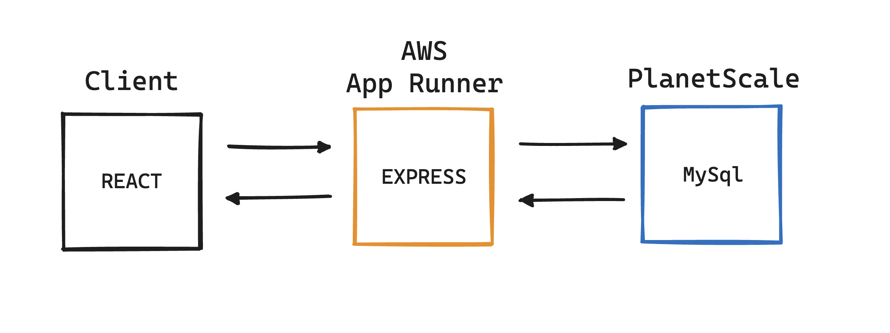
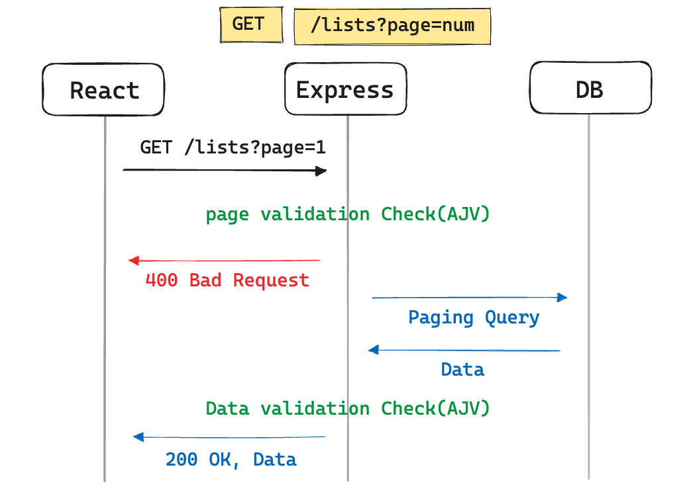
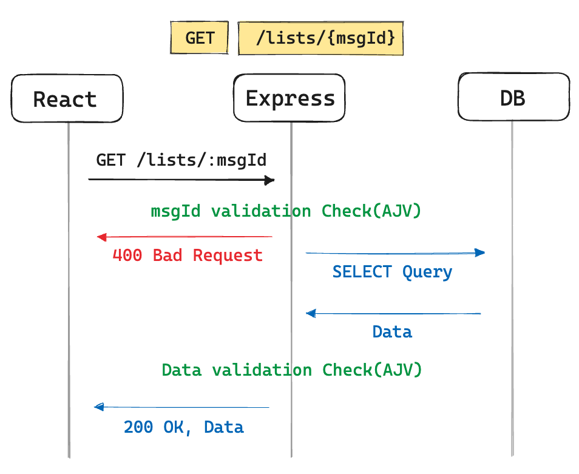
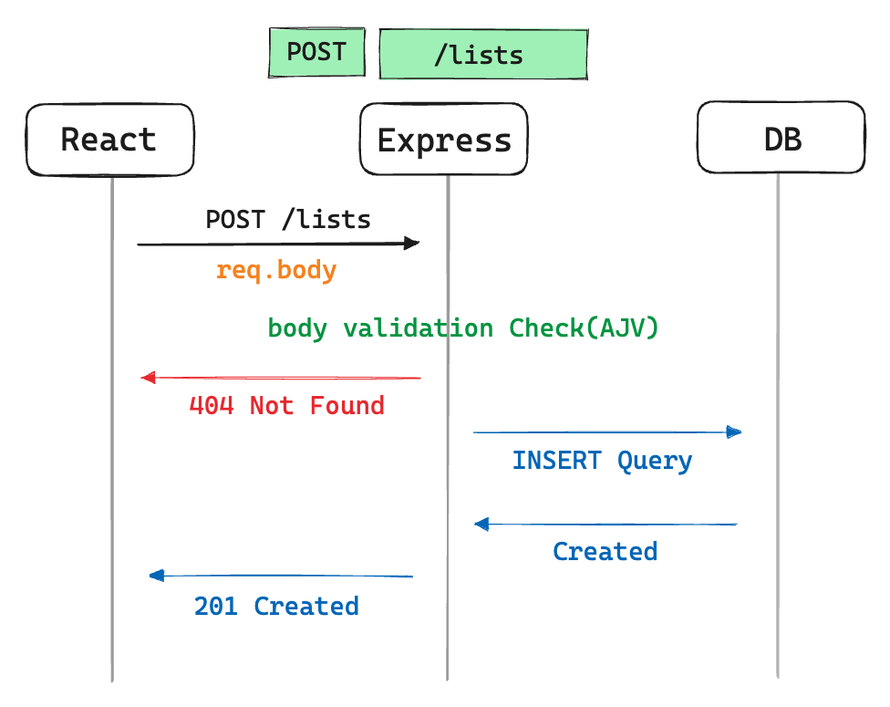
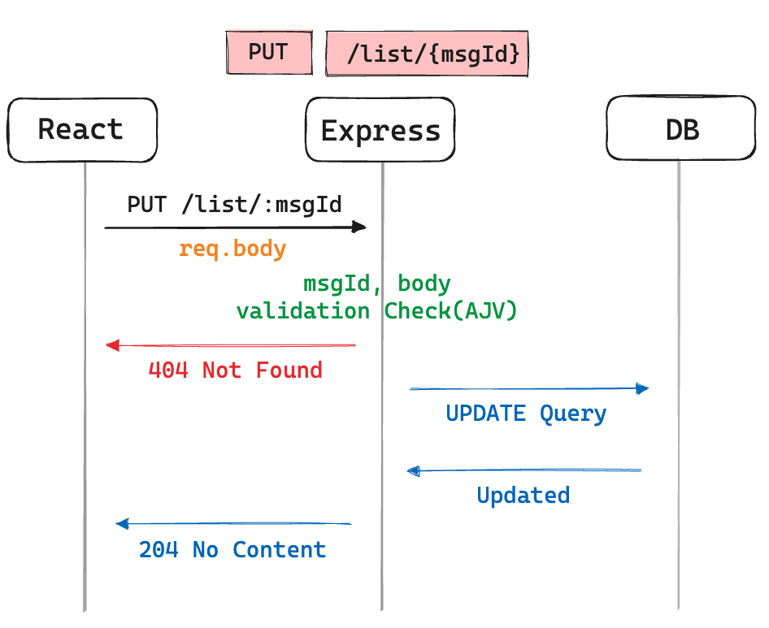
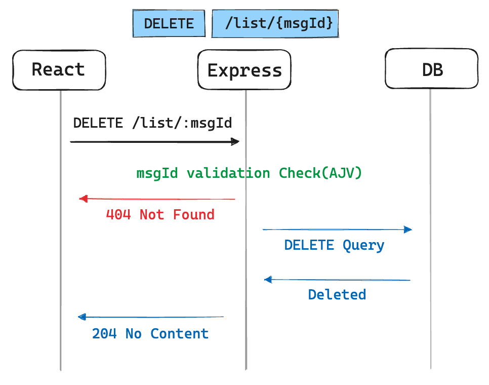
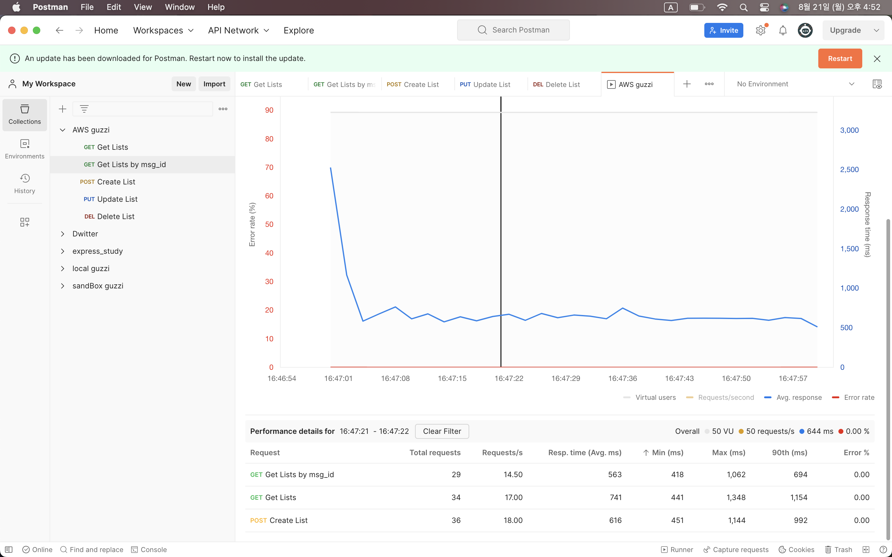
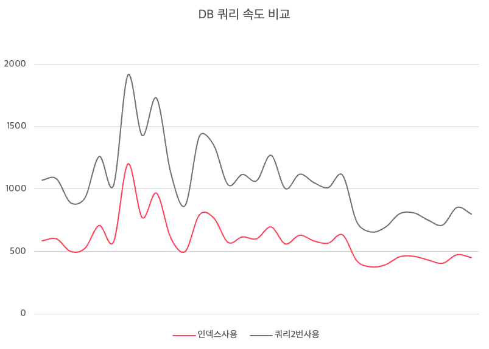

[✔]: ./image/checkbox-small-blue.png

# GUZZI 프로젝트


<br/>

## 목차

1. [프로젝트 설명](#1-프로젝트-설명)
2. [기술 스택](#2-기술-스택-technique-used)
3. [아키텍처 시각화](#3-아키텍처-및-시퀀스-다이어그램)
4. [DB 구성](#4-db-구성)
5. [API-명세](#5-api-명세)
6. [성능 테스트](#6-성능-테스트)
7. [트러블 슈팅](#7-트러블-슈팅)

<br/><br/>

# `1. 프로젝트 설명`

## 프로젝트 설명

**GUZZI**는 소비로서 마음을 채우는게 아니라 절약으로서 나 스스로를 명품으로 만들자 라는 의미로 만들어졌습니다. <br/>
최근 경기악화와 물가상승, 금리 인상 등으로 으로 인해 생활비를 절약하자는 분위기가 생성되고 있습니다. <br/>
혼자서는 소비를 절제하기 힘들지만 함께 절약함으로써 동기부여도 되고, 절약을 즐겁게 만들고 싶어 제작하게 되었습니다.

## 프로젝트 링크

최종 배포 링크 : https://all-chat.netlify.app/guzzi </br>
백엔드 Repo 링크 : https://github.com/mingle-mongle/guzzi </br>
프론트엔드 Repo 링크 : https://github.com/HyeyonJ/room-of-GUZZI </br>

## Directory Structure

```
📂 backend
    📂 guzzi
    ├── 📂 controller
    |   └── 📄 list.js
    ├── 📂 data
    |   └── 📄 list.js
    ├── 📂 db
    |   └── 📄 database.js
    ├── 📂 router
    |   └── 📄 lists.js
    ├── 📂 schema
    |   ├── 📄 list.js
    |   └── 📄 validate.js
    ├── 📄 swagger.js
    ├── 📄 server.js
    ├── 📄 app.js
    ├── 📄 package.json
    ├── 📄 README.md
    └── 📄 .prettierrc.json
```

<br/><br/>

<p align="right"><a href="#목차">⬆ 목차로 돌아가기</a></p>

# `2. 기술 스택 (Technique Used)`

## Language

|  |
| :---------------------------------------------------------------------------------------------------------------------------------------------------------------------------: |
|                                                      [Javascript](https://developer.mozilla.org/ko/docs/Web/JavaScript)                                                       |

## Server Management Tools

|  |
| :------------------------------------------------------------------------------------------------------------------------------------: |
|                                               [nodemon](https://github.com/remy/nodemon)                                               |

## Server(back-end)

|  |  |
| :---------------------------------------------------------------------------------------------------------------------------------------: | :----------------------------------------------------------------------------------------------------: |
|                                                 [Nodejs v16.17.0](https://nodejs.org/ko/)                                                 |                               [Express v4.18](https://expressjs.com/ko/)                               |

## Database

|  |
| :-----------------------------------------------------------------------------------------------------------------------------------------------------------------------------------------------------: |
|                                                                                     [MySQL](https://www.mysql.com/)                                                                                     |

## 사용된 오픈소스(Used Open Source)

- backend
  - [ajv](https://github.com/ajv-validator/ajv)
  - [cors](https://github.com/expressjs/cors)
  - [dotenv](https://github.com/motdotla/dotenv)
  - [helmet](https://github.com/helmetjs/helmet)
  - [morgan](https://github.com/expressjs/morgan)
  - [uuid](https://github.com/uuidjs/uuid)
  - [jsdoc](https://github.com/jsdoc/jsdoc)
  - [prettier](https://github.com/prettier/prettier)
  - [swagger-jsdoc](https://github.com/Surnet/swagger-jsdoc)
  - [swagger-ui](https://github.com/swagger-api/swagger-ui)

<br/>

<p align="right"><a href="#목차">⬆ 목차로 돌아가기</a></p>

# `3. 아키텍처 및 시퀀스 다이어그램`

<details open="open">
  <ul>
  <li> ᐅ 아키텍처 </li>
	<table align="center">
		<tr>
			<td align="center"><b>3tier architecture</b></td>
		</tr>
		<tr>
			<td align="center">
				
			</td>
		</tr>
		<tr>
			<td align="center">
				Client : REACT </br>
        Server : Aws App Runner(Express) </br>
        Database : PlanetScale(MySQL) </br>
			</td>
		</tr>
	</table>
    <li> ᐅ GET </li>
	<table align="center">
		<tr>
			<td align="center"><b>채팅 리스트 페이지별 요청</b></td>
		</tr>
		<tr>
			<td align="center">
				
			</td>
		</tr>
		<tr>
			<td align="center">
				페이지 Validation check를 한 후, 올바른 요청일 경우 DB에 SELECT 쿼리를 넘깁니다. </br>
        받아온 데이터에 이상이 있을 수 있으니, 데이터도 Validation check를 해줍니다. </br>
        정확한 데이터일 경우 200 OK 응답코드와 데이터를 보내줍니다.        
			</td>
		</tr>
	</table>
	<table align="center">
		<tr>
			<td align="center"><b>채팅 리스트 메시지 아이디별 요청</b></td>
		</tr>
		<tr>
			<td align="center">
				
			</td>
		</tr>
		<tr>
			<td align="center">
				메세지 아이디를 Validation check를 한 후, 올바른 요청일 경우 DB에 SELECT 쿼리를 넘깁니다. </br>
        받아온 데이터에 이상이 있을 수 있으니, 데이터도 Validation check를 해줍니다. </br>
        정확한 데이터일 경우 200 OK 응답코드와 데이터를 보내줍니다.
			</td>
		</tr>
	</table>
    <li> ᐅ POST  </li>
	<table align="center">
		<tr>
			<td align="center"><b>채팅 메시지 추가</b></td>
		</tr>
		<tr>
			<td align="center">
				
			</td>
		</tr>
		<tr>
			<td align="center">
			  body값에 대한 Validation check를 한 후, 올바른 요청일 경우 DB에 INSERT 쿼리를 넘깁니다. </br>
        DB에 INSERT 성공 시 201 Created 응답코드를 보내줍니다. 
			</td>
		</tr>
	</table>
	    <li> ᐅ PUT </li>
	<table align="center">
		<tr>
			<td align="center"><b>채팅 메시지 수정</b></td>
		</tr>
		<tr>
			<td align="center">
				
			</td>
		</tr>
		<tr>
			<td align="center">
				메세지 아이디와 body값에 대한 Validation check를 한 후, 올바른 요청일 경우 DB에 UPDATE 쿼리를 넘깁니다. </br>
        DB에 UPDATE 성공 시 204 No Content 응답코드를 보내줍니다. 
			</td>
		</tr>
	</table>
	    <li> ᐅ DELETE </li>
    	<table align="center">
		<tr>
			<td align="center"><b>채팅 메시지 삭제</b></td>
		</tr>
		<tr>
			<td align="center">
				
			</td>
		</tr>
		<tr>
			<td align="center">
			  메세지 아이디를 Validation check를 한 후, 올바른 요청일 경우 DB에 DELETE 쿼리를 넘깁니다. </br>
        DB에서 DELETE 성공 시 204 No Content 응답코드를 보내줍니다. 
			</td>
		</tr>
	</table>
	
  </ul>
</details>

<br/>

<p align="right"><a href="#목차">⬆ 목차로 돌아가기</a></p>

# `4. DB 구성`

## data Table Schema

채팅 메세지에 관련된 정보를 저장합니다.

|  Field  |     Type     | Null |     Key     |       Default       |                     Extra                     |
| :-----: | :----------: | :--: | :---------: | :-----------------: | :-------------------------------------------: |
| msg_id  |  BINARY(16)  |  NO  | PRIMARY KEY | UUID_TO_BIN(UUID()) |               DEFAULT_GENERATED               |
| content |     TEXT     |  NO  |     YES     |                     |                                               |
|  type   | VARCHAR(255) | YES  |             |                     |                                               |
|  time   |  BIGINT(20)  | YES  |             |                     |                                               |
|  image  |     TEXT     | YES  |             |                     |                                               |
| created |  TIMESTAMP   |  NO  |             |  CURRENT_TIMESTAMP  |               DEFAULT_GENERATED               |
| updated |  TIMESTAMP   | YES  |             |  CURRENT_TIMESTAMP  | DEFAULT_GENERATED ON UPDATE CURRENT TIMESTAMP |
|  user   |     JSON     | YES  |             |                     |                                               |
| version | VARCHAR(255) | YES  |             |                     |                                               |

<br/>

<p align="right"><a href="#목차">⬆ 목차로 돌아가기</a></p>

# `5. API 명세`

## ![✔] 5.1. Swagger

🔗 [**Swagger Link : API 테스트 가능**](링크 넣어야함)

<br/>

<p align="right"><a href="#목차">⬆ 목차로 돌아가기</a></p>

# `6. 성능 테스트`

## ![✔] 6.1. 10분 테스트 내용(수정예정)



이 부분은 추가적으로 다시 테스트 한 후 수정할 예정입니다.
포스트맨 캡쳐 사용하지 않을 예정입니다.

**핵심요약:** 10분간 어쩌구저쩌구.. 테스트했을시.. 어쩌구저쩌구..

<br/>

<p align="right"><a href="#목차">⬆ 목차로 돌아가기</a></p>

# `7. 트러블 슈팅`

<br/>
트러블 슈팅 목차 </br>

7.1 [DB Buffer Memory 문제](#7.1-db-buffer-memory-문제)

<!-- ## ![✔] 7.1. DB Buffer Memory 문제 -->

**핵심요약:** Sort Buffer Memory 부족을 해결하기 위해 인덱스를 사용했다.

**그렇게 하지 않을 경우:** 데이터가 262KB(이미지 25개)이상 들어간 후 "ORDER BY" 쿼리를 사용하면 `out of sort memory (errno 1038)`가 발생한다.



| 방법             | 인덱스 사용 | 총 요청 수 | 초당 요청 수 | 평균 응답 시간 | 최대 응답 시간 | Error % |
| ---------------- | ----------- | ---------- | ------------ | -------------- | -------------- | ------- |
| DESC 인덱스 사용 | O           | 11,669     | 19.28        | 180~220 ms     | 3,212          | 0       |
| 쿼리 2번 요청    | X           | 11,652     | 19.25        | 80~100 ms      | 4,809          | 0       |

🔗 [**자세히 보기: DB Buffer Memory 문제**](bufferMemory.md)

<br/><br/><br/><br/><br/><br/><br/><br/><br/><br/><br/><br/><br/><br/><br/><br/><br/><br/><br/><br/><br/><br/><br/><br/><br/><br/><br/><br/><br/><br/>

## 7.1 DB Buffer Memory 문제

여기로 이동해오는지 테스트

<br/>

<p align="right"><a href="#목차">⬆ 목차로 돌아가기</a></p>
